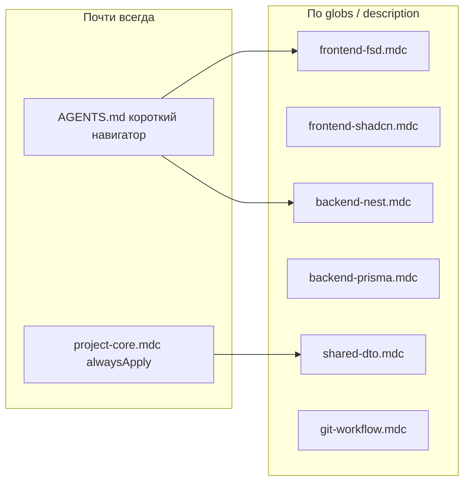

# План: AGENTS.md → Cursor `.mdc` rules

## Зачем

Сейчас вся проектная «энциклопедия» лежит в трёх `AGENTS.md`. Корневой файл легко оказывается в контексте **каждого** чата (как workspace rule), хотя для правки `backend/src/auth` не нужны FSD и shadcn-подводные камни, а для `features/transactions/list` — не нужен список Nest-эндпоинтов.

Цель: **короткий всегда-доступный каркас** + **умные правила**, которые сами подключаются по путям файлов.



## Принцип разделения

| Тип контента                                                                 | Куда                                                          | Почему                                                                   |
| ---------------------------------------------------------------------------- | ------------------------------------------------------------- | ------------------------------------------------------------------------ |
| Карта репо, стек в 5 строк, ссылки, команды                                  | Оставить в `AGENTS.md`                                        | Нужно «где что искать» в любом чате                                      |
| Повелительные правила кода («не дублируй DTO», «импорты только сверху вниз») | `.mdc` с `globs`                                              | Должны срабатывать в момент правки файлов                                |
| Справочник «что уже реализовано» (экраны, эндпоинты)                         | Укоротить в `frontend/` и `backend/AGENTS.md`                 | Это снимок состояния; в `.mdc` он раздувает контекст и быстро устаревает |
| Исторические фиксы (lint circular JSON, shared CJS)                          | Убрать из agent-контекста или 1–2 строки в workspace `AGENTS` | Уже исправлено; не стоит платить токенами каждый раз                     |
| GitHub Flow / Conventional Commits / PR body                                 | `.mdc` с `alwaysApply: false` + сильным `description`         | Нужно при коммитах/PR, не при каждой UI-правке                           |

Правила писать **коротко** (~30–50 строк), одно беспокойство на файл, без простыней из текущего `frontend/AGENTS.md`.

## Что создать в `.cursor/rules/`

### 1. [`project-core.mdc`](.cursor/rules/project-core.mdc) — `alwaysApply: true`

Минимум, без которого агент ломает монорепо:

- Turborepo + pnpm, Node 22; команды только из корня
- workspaces: `frontend`, `backend`, `packages/*`
- типы/DTO только в `@expense-tracker/shared`
- tsconfig/eslint только из `@expense-tracker/tsconfig` / `@expense-tracker/eslint-config`
- `.env*` не коммитить
- ссылки: читай `frontend/AGENTS.md` / `backend/AGENTS.md` при глубокой работе в воркспейсе

Не дублировать полный список модулей и FSD.

### 2. [`frontend-fsd.mdc`](.cursor/rules/frontend-fsd.mdc)

```yaml
globs: frontend/src/**/*.{ts,tsx}
alwaysApply: false
```

Из [frontend/AGENTS.md](frontend/AGENTS.md) вынести только **правила**:

- слои `app → views → widgets → features → entities → shared`
- запрет горизонтальных импортов и deep imports
- публичный API слайса через `index.ts`
- `views/`, не `pages/` (конфликт с Next)
- сегменты `ui/` / `model/` / `api/`
- Zustand для клиентского auth-стейта, TanStack Query для API
- формы: react-hook-form + zod

Без каталога «что лежит на `/` и `/categories`».

### 3. [`frontend-shadcn.mdc`](.cursor/rules/frontend-shadcn.mdc)

```yaml
globs: frontend/src/**/*.{tsx,css}
alwaysApply: false
```

Три рабочих подводных камня из раздела shadcn:

- `shadcn add` не синхронизирует токены — сверять с `frontend/src/app/globals.css`
- `Label`/`FormLabel` = `flex` ломает inline-ссылки → `className="inline ..."`
- кастомная подсветка ошибок для чекбокса согласия (`FormMessage` vs рамка)

### 4. [`backend-nest.mdc`](.cursor/rules/backend-nest.mdc)

```yaml
globs: backend/src/**/*.ts
alwaysApply: false
```

Паттерны, не полный OpenAPI-список:

- Auth: JWT + `JwtAuthGuard` + `@CurrentUser()`
- Categories: `Controller → Service → Repository` (без CQRS)
- Users / Transactions: CQRS (`CommandBus`/`QueryBus`)
- изоляция владельца: чужой ресурс → `404`; дубликат → `409`
- транзакции: проверка `categoryId` владельца; `summary` до `:id`
- DTO-типы в shared + class-validator в модуле
- безопасность в 5 буллетах: `validateEnv`, helmet, throttler на auth, PrismaExceptionFilter, Swagger не в production

Детальный перечень маршрутов оставить в [backend/AGENTS.md](backend/AGENTS.md) как справочник.

### 5. [`backend-prisma.mdc`](.cursor/rules/backend-prisma.mdc)

```yaml
globs: backend/prisma/**/*
alwaysApply: false
```

- одна схема `backend/prisma/schema.prisma`
- `@@map` → snake_case
- `PrismaService` глобальный
- модель `Expense` удалена — не возвращать

### 6. [`shared-dto.mdc`](.cursor/rules/shared-dto.mdc)

```yaml
globs: packages/shared/**/*.{ts,json}
alwaysApply: false
```

- пакет собирается в CJS `dist/` (backend CommonJS)
- не класть Nest-validators в shared (валидаторы остаются в backend DTO-классах, если так уже устроено)
- при смене контракта — обновлять shared и потребителей вместе

### 7. [`git-workflow.mdc`](.cursor/rules/git-workflow.mdc)

```yaml
alwaysApply: false
description: GitHub Flow, Conventional Commits на русском, правила PR и веток. Использовать при коммитах, ветках, PR, gh.
```

Без `globs` — agent-requestable по description (когда пользователь просит commit/PR).

Содержимое из корневого [AGENTS.md](AGENTS.md): ветки, title/body PR, формат коммита.

## Как ужать AGENTS.md после выноса

### Корневой [AGENTS.md](AGENTS.md)

Оставить ~40–60 строк:

- что это + стек + структура-дерево
- 4 bullet соглашений (или «детали в `.cursor/rules`»)
- команды
- ссылки на `frontend/AGENTS.md`, `backend/AGENTS.md`, `.cursor/rules/`
- убрать (или сильно сократить) разделы Ветки / PR / Коммиты — они уедут в `git-workflow.mdc`

### [frontend/AGENTS.md](frontend/AGENTS.md)

Справочник состояния UI (что на каких маршрутах), порт, env. Убрать дубли FSD-правил и shadcn — заменить одной строкой: «правила FSD/shadcn — `.cursor/rules/frontend-*.mdc`».

### [backend/AGENTS.md](backend/AGENTS.md)

Справочник эндпоинтов и модулей + env. Убрать длинные «как писать архитектуру» / hardening / исторические фиксы — ссылка на `backend-nest.mdc` / `backend-prisma.mdc`.

## Чего не выносить в `.mdc`

- Полные каталоги «Auth UI делает X / dashboard джойнит categories на клиенте» — это changelog feature; агент лучше смотрит код + короткий AGENTS.
- История починок lint/shared — в archive или вовсе удалить из agent docs.
- Дублирование одного и того же правила и в AGENTS, и в `.mdc` — в AGENTS оставлять только указатель.

## Порядок работ

1. Создать `.cursor/rules/` и 7 файлов выше (сначала наполнить из текущих AGENTS, потом подчистить AGENTS).
2. Урезать три `AGENTS.md` до навигатора + справочников реализованного.
3. Проверить на двух сценариях вручную: чат только по frontend-файлу (должны подтянуться FSD/shadcn, не Nest) и чат только по `backend/prisma` (Prisma, не FSD).
4. Один docs-коммит: `docs: вынеси правила воркспейсов в Cursor .mdc`.

## Критерий успеха

- В «пустом» чате по репо — только `project-core` + короткий корневой AGENTS, без FSD/shadcn/CQRS.
- При открытых `frontend/src/features/**` — автоматически FSD (и shadcn при `.tsx`).
- При работе с Prisma — автоматически prisma-правила.
- Объём всегда-платимого контекста заметно меньше текущего полного корневого `AGENTS.md`.
