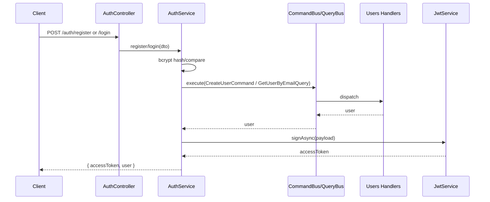

# Авторизация API через JWT

## Решения (подтверждены)

- Эндпоинты: `POST /auth/register`, `POST /auth/login`.
- Токены: только access-токен (JWT).
- Пароль: bcrypt-хэш хранится в существующем поле `User.password`.
- Межмодульное взаимодействие: через CQRS (`@nestjs/cqrs`). `AuthModule` не инжектит `UsersService` напрямую, а шлёт команды/запросы через `CommandBus`/`QueryBus`. `UsersModule` регистрирует хендлеры.

## 1. Зависимости

Добавить в [backend/package.json](../../backend/package.json):

- `@nestjs/jwt`, `@nestjs/passport`, `@nestjs/cqrs`, `passport`, `passport-jwt`, `bcrypt`
- dev: `@types/passport-jwt`, `@types/bcrypt`

## 2. Схема Prisma

В [backend/prisma/schema.prisma](../../backend/prisma/schema.prisma) в модель `User` добавить служебное поле роли (для будущей авторизации):

```prisma
role String @default("USER")
```

Затем миграция: `pnpm --filter backend prisma:migrate` (dev-миграция `add_user_role`). Поле `password` уже есть — используется под bcrypt-хэш.

## 3. Общие типы/DTO в shared

В [packages/shared/src/types/user.ts](../../packages/shared/src/types/user.ts) дополнить:

- `LoginDto { email; password }`
- `AuthResponse { accessToken: string; user: User }`
- `JwtPayload { sub: string; email: string }`

(`CreateUserDto` уже есть и подходит для регистрации.)

## 4. Модуль пользователей `backend/src/users/` (CQRS)

- `users.repository.ts` — тонкая обёртка над `PrismaService`: `findByEmail`, `findById`, `create`.
- `users.service.ts` — бизнес-логика: `create` (проверка уникальности email, `ConflictException`), `findByEmail`, `findById`. Возврат наружу без поля `password`. Используется хендлерами.
- Commands (`commands/`):
  - `create-user.command.ts` + `handlers/create-user.handler.ts` (`@CommandHandler(CreateUserCommand)`) — вызывает `UsersService.create`.
- Queries (`queries/`):
  - `get-user-by-email.query.ts` + `handlers/get-user-by-email.handler.ts` — возвращает пользователя с `password` (для проверки пароля в auth); nullable.
  - `get-user-by-id.query.ts` + `handlers/get-user-by-id.handler.ts` — возвращает публичного пользователя (для JwtStrategy).
- `dto/create-user.dto.ts` — класс с `class-validator` (`@IsEmail`, `@IsString`, `@MinLength`) для Swagger/валидации.
- `users.module.ts` — импортирует `CqrsModule`; провайдит `UsersService`, `UsersRepository` и все хендлеры. Экспорт наружу не нужен — доступ только через шину.

## 5. Модуль авторизации `backend/src/auth/`

- `auth.service.ts` (инжектит `CommandBus`, `QueryBus`, `JwtService`):
  - `register(dto)` — хэширует пароль `bcrypt.hash`, `commandBus.execute(new CreateUserCommand(...))`, возвращает `AuthResponse` с подписанным токеном.
  - `validateUser(email, password)` — `queryBus.execute(new GetUserByEmailQuery(email))`, сверяет `bcrypt.compare`, иначе `UnauthorizedException`.
  - `login(dto)` — валидирует и возвращает `AuthResponse`.
  - `signToken(user)` — `JwtService.signAsync({ sub, email })`.
- `strategies/jwt.strategy.ts` — `PassportStrategy(Strategy)`, извлечение Bearer-токена, секрет из `ConfigService`, `validate` грузит пользователя через `queryBus.execute(new GetUserByIdQuery(sub))`.
- `guards/jwt-auth.guard.ts` — `AuthGuard('jwt')` (переиспользуемый для будущих защищённых роутов).
- `decorators/current-user.decorator.ts` — параметр-декоратор `@CurrentUser()` (пригодится далее).
- `dto/login.dto.ts` — валидируемый DTO.
- `auth.controller.ts` — `@Controller('auth')` с `register`/`login`, Swagger-декораторы (`@ApiTags`, `@ApiOperation`).
- `auth.module.ts` — импортирует `CqrsModule`, `JwtModule.registerAsync` (секрет `JWT_SECRET`, `expiresIn` из env), `PassportModule`, `UsersModule` (чтобы хендлеры были зарегистрированы); провайдит `AuthService`, `JwtStrategy`.

## 6. Подключение и окружение

- Зарегистрировать `AuthModule` (и `UsersModule`) в [backend/src/app.module.ts](../../backend/src/app.module.ts).
- В [backend/src/main.ts](../../backend/src/main.ts) добавить `.addBearerAuth()` в `DocumentBuilder` для Swagger.
- Добавить `JWT_SECRET` и `JWT_EXPIRES_IN` в [backend/.env.example](../../backend/.env.example) (и локально в `.env`).

## Поток



## Проверка

- `pnpm --filter backend typecheck` и `pnpm --filter backend lint`.
- Ручной прогон через Swagger `/docs`: register -> login -> получить токен.
