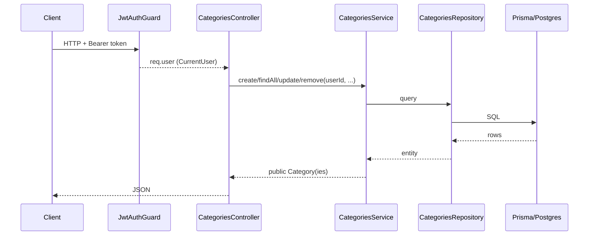

# Модуль категорий трат

## Чек-лист задач

- [ ] Добавить `UpdateCategoryDto` в `packages/shared/src/types/category.ts`
- [ ] Создать `create-category.dto.ts` и `update-category.dto.ts` с `class-validator` и Swagger-декораторами
- [ ] Создать `categories.repository.ts` (`create`, `findAllByUser`, `findById`, `update`, `delete`)
- [ ] Создать `categories.service.ts` с CRUD, проверкой владения и обработкой конфликта уникальности
- [ ] Создать `categories.controller.ts` с `JwtAuthGuard`, `@CurrentUser()` и Swagger-декораторами
- [ ] Создать `categories.module.ts` и зарегистрировать его в `app.module.ts`
- [ ] Прогнать `typecheck`/`lint` и проверить эндпоинты через Swagger

## Решения (подтверждены)

- Архитектура: прямой инжект `CategoriesController -> CategoriesService -> CategoriesRepository` (как `AuthController -> AuthService`), без CQRS.
- Защита: все эндпоинты под `@UseGuards(JwtAuthGuard)`; `userId` берётся из `@CurrentUser()`, а не из тела запроса.
- Изоляция по пользователю: `findAll` возвращает только категории текущего пользователя; `update`/`delete` проверяют владение (иначе `NotFoundException`).
- Уникальность имени: модель имеет `@@unique([userId, name])` — при конфликте кидаем `ConflictException`.

## Контекст (уже готово)

- Prisma-модель `Category` уже есть в [backend/prisma/schema.prisma](../../backend/prisma/schema.prisma) (`id`, `name`, `icon?`, `color?`, `userId`, `@@unique([userId, name])`). Миграция БД не требуется, если схема уже применена.
- Типы `Category` и `CreateCategoryDto` уже есть в [packages/shared/src/types/category.ts](../../packages/shared/src/types/category.ts).
- Гвард `JwtAuthGuard` и декоратор `@CurrentUser()` готовы к переиспользованию.

## 1. Общие типы (shared)

В [packages/shared/src/types/category.ts](../../packages/shared/src/types/category.ts) добавить:

```ts
export interface UpdateCategoryDto {
  name?: string;
  icon?: string;
  color?: string;
}
```

## 2. DTO с валидацией

- `backend/src/categories/dto/create-category.dto.ts` — реализует `CreateCategoryDto`, декораторы `class-validator` (`@IsString`, `@IsNotEmpty` для `name`; `@IsOptional` + `@IsString` для `icon`, `color`) и `@ApiProperty`/`@ApiPropertyOptional` для Swagger.
- `backend/src/categories/dto/update-category.dto.ts` — реализует `UpdateCategoryDto`, все поля опциональны (`@IsOptional`).

## 3. Репозиторий

`backend/src/categories/categories.repository.ts` — тонкая обёртка над `PrismaService` (по образцу [backend/src/users/users.repository.ts](../../backend/src/users/users.repository.ts)):

- `create(data)`, `findAllByUser(userId)`, `findById(id)`, `update(id, data)`, `delete(id)`.

## 4. Сервис

`backend/src/categories/categories.service.ts` — бизнес-логика (принимает `userId` явно):

- `create(userId, dto)` — создание; при нарушении unique — `ConflictException`.
- `findAll(userId)` — все категории пользователя.
- `update(userId, id, dto)` — проверка владения через `findById` (иначе `NotFoundException`), затем обновление.
- `remove(userId, id)` — проверка владения, затем удаление.
- Приватный `toPublic(category)` — сериализация дат в ISO-строки (как `toPublicUser`).

## 5. Контроллер

`backend/src/categories/categories.controller.ts` — `@Controller('categories')`, `@ApiTags('categories')`, `@ApiBearerAuth()`, `@UseGuards(JwtAuthGuard)` на классе:

- `POST /categories` — `create(@CurrentUser() user, @Body() dto: CreateCategoryDto)`.
- `GET /categories` — `findAll(@CurrentUser() user)`.
- `PATCH /categories/:id` — `update(@CurrentUser() user, @Param('id') id, @Body() dto: UpdateCategoryDto)`.
- `DELETE /categories/:id` — `remove(@CurrentUser() user, @Param('id') id)`.

Каждый метод снабжается `@ApiOperation`. Валидация работает через глобальный `ValidationPipe` (уже настроен в `main.ts`).

## 6. Модуль и подключение

- `backend/src/categories/categories.module.ts` — `controllers: [CategoriesController]`, `providers: [CategoriesService, CategoriesRepository]`. Импортировать `AuthModule` (или `PassportModule`), чтобы `JwtAuthGuard`/стратегия `jwt` были доступны.
- Зарегистрировать `CategoriesModule` в [backend/src/app.module.ts](../../backend/src/app.module.ts).

## Поток запроса



## Проверка

- `pnpm --filter backend typecheck` и `pnpm --filter backend lint`.
- (Если shared собирается отдельно) пересобрать `@expense-tracker/shared`.
- Ручной прогон в Swagger `/docs`: авторизоваться, затем `POST/GET/PATCH/DELETE /categories`; проверить, что чужие категории недоступны.
