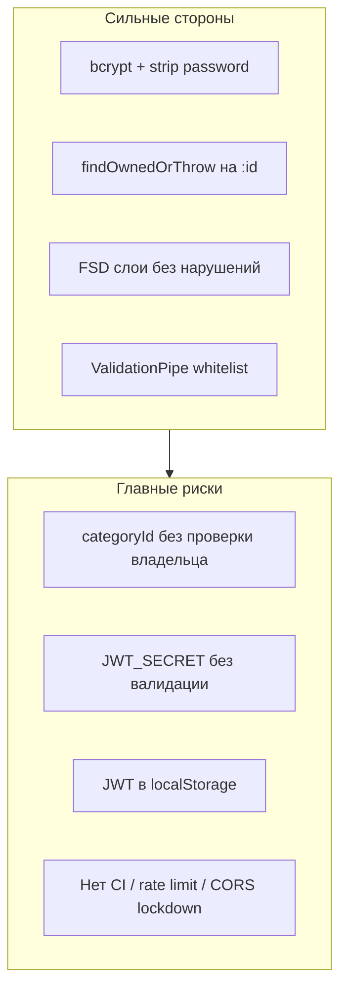

# Код-ревью Expense Tracker

Комплексный аудит монорепозитория: безопасность, качество кода, соблюдение FSD и проектных паттернов. База заложена хорошо; главные риски — IDOR при привязке категорий, слабая конфигурация JWT, отсутствие CI и несколько дыр в auth-потоке на фронте.

## Чек-лист задач

- [x] Добавить проверку владельца `categoryId` в `TransactionsService` create/update
- [x] Fail-fast валидация `JWT_SECRET` и обязательных env при старте backend
- [x] Добавить `@Max` на `limit`, `@IsPositive` на `amount`, Prisma exception filter
- [x] Очистка React Query при logout, 401 interceptor, fix timezone в create transaction
- [x] GitHub Actions (lint/typecheck/build), throttler, CORS/helmet для prod
- [x] Вынести categories list в `features/categories/list` + ESLint FSD boundaries
- [x] Удалить или реализовать мёртвые `Expense`/`ExpenseCategory` артефакты
- [x] Unit-тесты на ownership, DTO validation, auth flows

## Вердикт

Проект — аккуратная заготовка с продуманной архитектурой (FSD на фронте, CQRS там, где задокументировано, shared-контракты, Prisma-only доступ к БД). **Критических уязвимостей в продакшене пока нет** (это локальный scaffold), но есть **одна реальная логическая дыра авторизации (IDOR)** и несколько **системных пробелов**, которые станут проблемой при деплое.



---

## Критические и высокие находки

### 1. IDOR: транзакция может ссылаться на чужую категорию (High)

**Файл:** [backend/src/transactions/transactions.service.ts](../../backend/src/transactions/transactions.service.ts)

При `create`/`update` проверяется только `userId` самой транзакции, но **не проверяется**, что `categoryId` принадлежит тому же пользователю. FK в Prisma гарантирует лишь существование категории.

```13:21:backend/src/transactions/transactions.service.ts
  async create(userId: string, dto: CreateTransactionDto): Promise<Transaction> {
    const transaction = await this.transactionsRepository.create({
      userId,
      // ...
      categoryId: dto.categoryId,
    });
```

**Исправление:** перед create/update вызывать `CategoriesService.findOwnedOrThrow(userId, dto.categoryId)` или добавить проверку в репозиторий. Долгосрочно — composite constraint на уровне приложения/БД.

---

### 2. JWT secret без fail-fast валидации (High)

**Файлы:** [backend/src/auth/strategies/jwt.strategy.ts](../../backend/src/auth/strategies/jwt.strategy.ts), [backend/src/app.module.ts](../../backend/src/app.module.ts), [backend/.env.example](../../backend/.env.example)

```18:18:backend/src/auth/strategies/jwt.strategy.ts
      secretOrKey: configService.get<string>("JWT_SECRET") ?? "",
```

- Пустой fallback `""` при отсутствии env
- `ConfigModule.forRoot()` без `validationSchema`
- В `.env.example` — `JWT_SECRET="change-me"`

**Исправление:** Zod/Joi-схема при старте; отказ запуска без `JWT_SECRET` (кроме явного dev-режима); убрать `?? ""`.

---

### 3. JWT в `localStorage` (High для production)

**Файл:** [frontend/src/entities/user/model/store.ts](../../frontend/src/entities/user/model/store.ts)

Токен и user персистятся в `localStorage`. Любой XSS → кража bearer-токена.

**Контекст:** для scaffold это типично; AGENTS.md упоминает in-memory token, но не акцентирует риск persistence.

**Исправление (при деплое):** httpOnly cookie + CSRF, или memory-only token + refresh flow + строгий CSP.

---

## Средние находки

### Backend

| # | Проблема | Где | Рекомендация |
|---|----------|-----|--------------|
| B1 | Открытый CORS | [backend/src/main.ts](../../backend/src/main.ts):10 | `origin` whitelist в production |
| B2 | Нет rate limiting на `/auth/*` | [backend/src/auth/auth.controller.ts](../../backend/src/auth/auth.controller.ts) | `@nestjs/throttler` |
| B3 | Неограниченный `limit` в пагинации | [backend/src/transactions/dto/query-transactions.dto.ts](../../backend/src/transactions/dto/query-transactions.dto.ts) | `@Max(100)` |
| B4 | `amount` без `@IsPositive()` | [backend/src/transactions/dto/create-transaction.dto.ts](../../backend/src/transactions/dto/create-transaction.dto.ts) | Синхронизировать с фронтом |
| B5 | Race на регистрации → Prisma P2002 → 500 | [backend/src/users/users.service.ts](../../backend/src/users/users.service.ts) | Глобальный Prisma exception filter |
| B6 | FK-ошибки (удаление категории с транзакциями) → 500 | [backend/src/categories/categories.service.ts](../../backend/src/categories/categories.service.ts) | P2003 → 409/400 |
| B7 | Swagger `/docs` всегда открыт | [backend/src/main.ts](../../backend/src/main.ts):25 | Отключать в production |
| B8 | Нет security headers (helmet) | [backend/src/main.ts](../../backend/src/main.ts) | `helmet` middleware |
| B9 | Login timing oracle | [backend/src/auth/auth.service.ts](../../backend/src/auth/auth.service.ts) | Всегда вызывать `bcrypt.compare` (dummy hash) |
| B10 | Email не нормализуется | DTO users | `toLowerCase()` + unique index case-insensitive |
| B11 | `User.role` в схеме, не в JWT/guards | [backend/prisma/schema.prisma](../../backend/prisma/schema.prisma) | Убрать или заложить RBAC до экспозиции |

### Frontend

| # | Проблема | Где | Рекомендация |
|---|----------|-----|--------------|
| F1 | Logout не чистит React Query cache | [frontend/src/entities/user/model/store.ts](../../frontend/src/entities/user/model/store.ts) | `queryClient.clear()` при logout — риск flash чужих данных |
| F2 | Нет глобального 401 → logout | [frontend/src/shared/api/client.ts](../../frontend/src/shared/api/client.ts) | Interceptor: 401 → `logout()` + redirect |
| F3 | Auth guard только на клиенте | [frontend/src/widgets/app-layout/ui/app-layout.tsx](../../frontend/src/widgets/app-layout/ui/app-layout.tsx) | `middleware.ts` для redirect (опционально) |
| F4 | Баг timezone при создании транзакции | [frontend/src/features/transactions/create/ui/create-transaction-dialog.tsx](../../frontend/src/features/transactions/create/ui/create-transaction-dialog.tsx) | `new Date(values.date).toISOString()` сдвигает дату в UTC+; отправлять `YYYY-MM-DD` или `T12:00:00` local |
| F5 | Список категорий в `views/`, не в `features/` | [frontend/src/views/categories/ui/categories-page.tsx](../../frontend/src/views/categories/ui/categories-page.tsx) | Вынести в `features/categories/list` по образцу `features/transactions/list` |
| F6 | Нет ESLint boundary rules для FSD | [frontend/eslint.config.mjs](../../frontend/eslint.config.mjs) | Steiger / `import/no-restricted-paths` |

### Инфраструктура

| # | Проблема | Где | Рекомендация |
|---|----------|-----|--------------|
| I1 | Нет CI (lint/typecheck/build/audit) | корень репо | GitHub Actions на PR |
| I2 | `.gitignore` не покрывает `.env.production` | [.gitignore](../../.gitignore) | Расширить паттерн |
| I3 | Docker: `postgres/postgres` на `5432` | [docker-compose.yml](../../docker-compose.yml) | OK для local; не для shared host |
| I4 | Мёртвые типы `Expense`/`ExpenseCategory` | [packages/shared/src/types/expense.ts](../../packages/shared/src/types/expense.ts), Prisma `Expense` | Удалить или реализовать |
| I5 | Нет тестов | весь репо | Unit для ownership/validation; e2e для auth |

---

## Низкие / информационные

- `ParseUUIDPipe` не на `:id` params → 500 вместо 400
- Слабая password policy (min 6, без max)
- `UpdateCategoryDto` допускает пустое `name`
- `ValidationPipe` без `forbidNonWhitelisted`
- Нет request timeout в `apiRequest`
- Пагинация без `aria-label` / `role="navigation"`
- Blank screen при hydration auth guard
- Drift валидации: frontend zod строже backend class-validator (name, category name, amount)
- `shared/` без barrel `index.ts` — допустимо для shadcn, но не канон FSD

---

## Что сделано хорошо

### Безопасность

- bcrypt (10 rounds), пароль не возвращается в API (`toPublicUser`)
- JWT re-validates user exists на каждый запрос ([jwt.strategy.ts](../../backend/src/auth/strategies/jwt.strategy.ts))
- Единообразный `findOwnedOrThrow` + 404 для чужих ресурсов по `:id`
- Prisma parameterized queries — нет SQL injection
- `ValidationPipe({ whitelist: true, transform: true })`
- Нет `dangerouslySetInnerHTML` / XSS-sinks на фронте

### Архитектура и паттерны

- FSD: тонкий `app/`, композиция в `views/`, нет горизонтальных импортов между `features/*`
- Публичные API слайсов через `index.ts` — deep imports не найдены
- CQRS в `users`/`transactions`, прямой слой в `categories` — соответствует [AGENTS.md](../../AGENTS.md)
- Shared DTO как контракт + class-validator на backend
- Entity query keys (`transactionKeys`, `categoryKeys`) + корректная invalidation на create
- Единый паттерн фич: zod → hook → form → `ApiError` alert

### Схема БД

- `@@unique([userId, name])` на категориях
- `email @unique`, каскады на user delete
- Индексы `[userId, date]` на transactions

---

## Соответствие AGENTS.md

| Утверждение | Статус |
|-------------|--------|
| FSD-слои и слайсы | Соответствует (кроме categories list в view) |
| Transactions CQRS | Соответствует |
| Categories без CQRS | Соответствует |
| Auth UI + persist | Соответствует, но security trade-off не описан |
| Expense модель | **Расхождение** — в Prisma/shared есть, API нет |
| Edit/delete категорий на фронте | Запланировано отдельно — OK |

---

## Приоритетный план исправлений

**Фаза 1 — безопасность данных (1–2 PR)**

1. Проверка владельца `categoryId` в transactions
2. Env validation + жёсткий `JWT_SECRET`
3. `@Max` на `limit`, `@IsPositive` на `amount`
4. Prisma exception filter (P2002/P2003)

**Фаза 2 — auth hardening (1 PR)**

5. Очистка React Query при logout
6. 401 interceptor в `apiRequest`
7. Исправление timezone bug в create transaction

**Фаза 3 — инфраструктура (1 PR)**

8. GitHub Actions: `pnpm lint`, `typecheck`, `build`
9. Throttler на auth, CORS/helmet для production config
10. Расширить `.gitignore`

**Фаза 4 — качество и FSD (по мере фич)**

11. `features/categories/list` + ESLint FSD boundaries
12. Удалить/реализовать `Expense` артефакты
13. Базовые тесты на ownership и DTO validation
14. Shared zod-схемы или codegen для синхронизации валидации

---

## Оценка по осям (1–5)

| Ось | Оценка | Комментарий |
|-----|--------|-------------|
| Безопасность | 3/5 | Хорошая база auth, но IDOR + config gaps |
| Качество кода | 4/5 | Чистый, консистентный TypeScript |
| Паттерны проекта | 4/5 | CQRS/FSD в основном соблюдены |
| FSD | 4/5 | Одно отклонение + нет автоматизации |
| Production-readiness | 2/5 | Нет CI, тестов, hardening |
