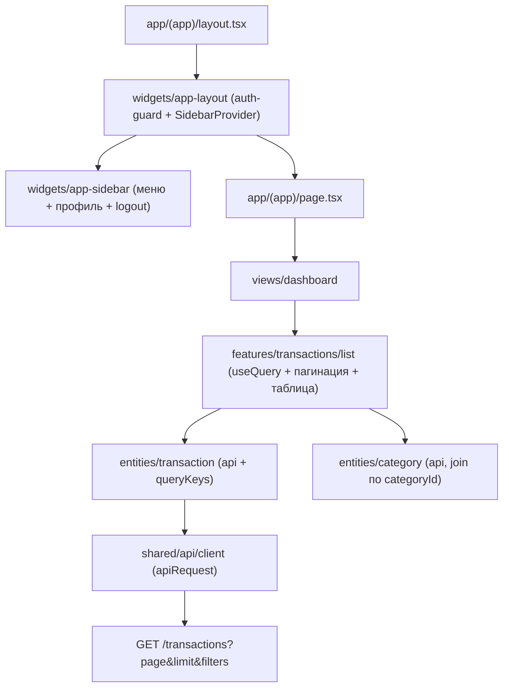

# Главный экран трекера расходов

Строим защищённый (auth-only) раздел приложения: боковое меню навигации + постраничный список транзакций (10/стр). Пагинация — серверная (добавляем в бэкенд). Разделы «Категории» и «Профиль» — минимальные страницы-заглушки внутри общего shell (полноценный CRUD — отдельными задачами).

## Архитектура



## 1. Бэкенд — серверная пагинация `GET /transactions`

- Общий тип в [packages/shared/src/types/transaction.ts](packages/shared/src/types/transaction.ts): добавить `page?`/`limit?` в `QueryTransactionsDto` и новый generic-результат:

```ts
export interface PaginatedResult<T> {
  items: T[];
  total: number;
  page: number;
  limit: number;
  totalPages: number;
}
```

- [backend/src/transactions/dto/query-transactions.dto.ts](backend/src/transactions/dto/query-transactions.dto.ts): добавить `page`/`limit` с `@Type(() => Number)` + `@IsInt()/@Min(1)` (query приходит строкой; проверить, что `ValidationPipe` в [backend/src/main.ts](backend/src/main.ts) с `transform: true`, иначе добавить), дефолты `page=1`, `limit=10`.
- [backend/src/transactions/transactions.repository.ts](backend/src/transactions/transactions.repository.ts): в `findAllByUser` добавить `skip`/`take` и вернуть `[items, total]` через `this.prisma.$transaction([findMany, count])` с тем же `where`/`orderBy: { date: "desc" }`.
- [backend/src/transactions/transactions.service.ts](backend/src/transactions/transactions.service.ts): `findAll` возвращает `PaginatedResult<Transaction>` (items через `toPublic`, `totalPages = Math.ceil(total/limit)`). Обновить handler `GetTransactionsQuery` и тип возврата в [backend/src/transactions/transactions.controller.ts](backend/src/transactions/transactions.controller.ts) (`@Get()` → `Promise<PaginatedResult<Transaction>>`).

Примечание: это меняет форму ответа с `Transaction[]` на объект — потребителей на фронте пока нет, безопасно.

## 2. shadcn/ui — добавить компоненты

`npx shadcn add sidebar table pagination skeleton dropdown-menu avatar separator badge` (в `frontend`).
Токены `--sidebar-*` уже есть в [frontend/src/app/globals.css](frontend/src/app/globals.css). Согласно AGENTS.md — после установки проверить, что новые компоненты не тянут отсутствующих CSS-токенов.

## 3. entities — данные

- `entities/transaction`: `api/get-transactions.ts` (`apiRequest<PaginatedResult<Transaction>>` с построением query-string из `{ page, limit, ...filters }`), `model/query-keys.ts` (`["transactions", params]`), публичный `index.ts`.
- `entities/category`: `api/get-categories.ts` (`GET /categories` → `Category[]`) + `model/query-keys.ts` — нужен, чтобы показывать имя/иконку категории в списке (в транзакции только `categoryId`).

## 4. widgets — оболочка и меню

- `widgets/app-layout`: клиентский guard по образцу `HomePage` (`hasHydrated` → `null`; `!isAuthenticated` → `router.replace("/login")`), оборачивает `SidebarProvider` + `AppSidebar` + `SidebarInset`/`main`.
- `widgets/app-sidebar`: пункты меню «Транзакции» (`/`), «Категории» (`/categories`), «Профиль» (`/profile`) с подсветкой активного через `usePathname`; в футере — имя/email пользователя из `useAuthStore` и `LogoutButton` из `features/auth/logout`.

## 5. Роутинг — route group `(app)`

- Создать `app/(app)/layout.tsx` → рендерит `widgets/app-layout`.
- Перенести главный маршрут: `app/(app)/page.tsx` → `views/dashboard` (маршрут остаётся `/`). Текущий гостевой `views/home` перестаёт быть точкой входа для `/`; неавторизованных guard уводит на `/login`.
- `app/(app)/categories/page.tsx` → `views/categories` (заглушка).
- `app/(app)/profile/page.tsx` → `views/profile` (данные из auth-стора).
- `login/register/terms/privacy` остаются вне группы (без сайдбара).

## 6. views + features — главный экран

- `views/dashboard`: заголовок «Транзакции» + рендер `TransactionsList`.
- `features/transactions/list`:
  - `model/use-transactions.ts`: локальный `useState(page)`, `useQuery({ queryKey, queryFn, enabled: isAuthenticated })`, `placeholderData: keepPreviousData`.
  - `ui/transactions-list.tsx`: `Table` со столбцами Дата / Описание / Категория / Тип (Badge INCOME/EXPENSE) / Сумма; join категорий по `categoryId`; `Skeleton` при загрузке; пустое состояние; `Alert` при ошибке.
  - `ui/transactions-pagination.tsx`: компонент `Pagination` (Prev/Next + номера), `limit=10`, дизейбл на границах по `totalPages`.
- `views/categories`, `views/profile`: заглушки в `Card` (профиль показывает `name`/`email`/дату регистрации из стора).

## Заметки

- Тип `TransactionType` — заглавные `INCOME`/`EXPENSE` (совпадает с API).
- Соблюдать FSD: публичный API слайсов только через `index.ts`, импорты сверху вниз.
- После правок бэкенда — миграции не нужны (схема не меняется); прогнать `pnpm typecheck`/`pnpm lint`/`pnpm build`.
